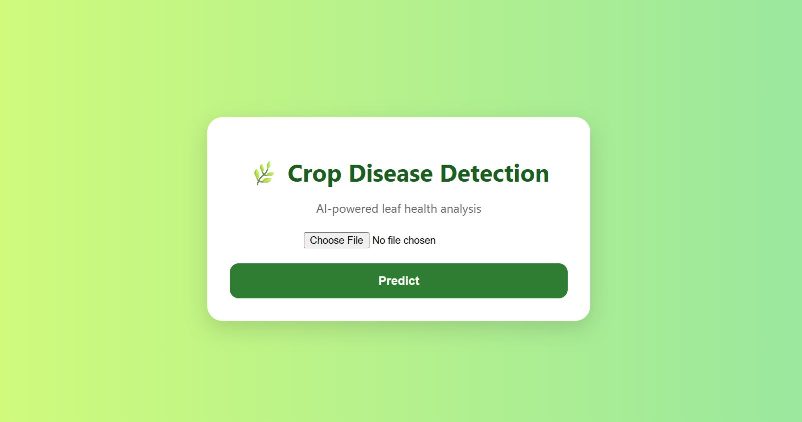
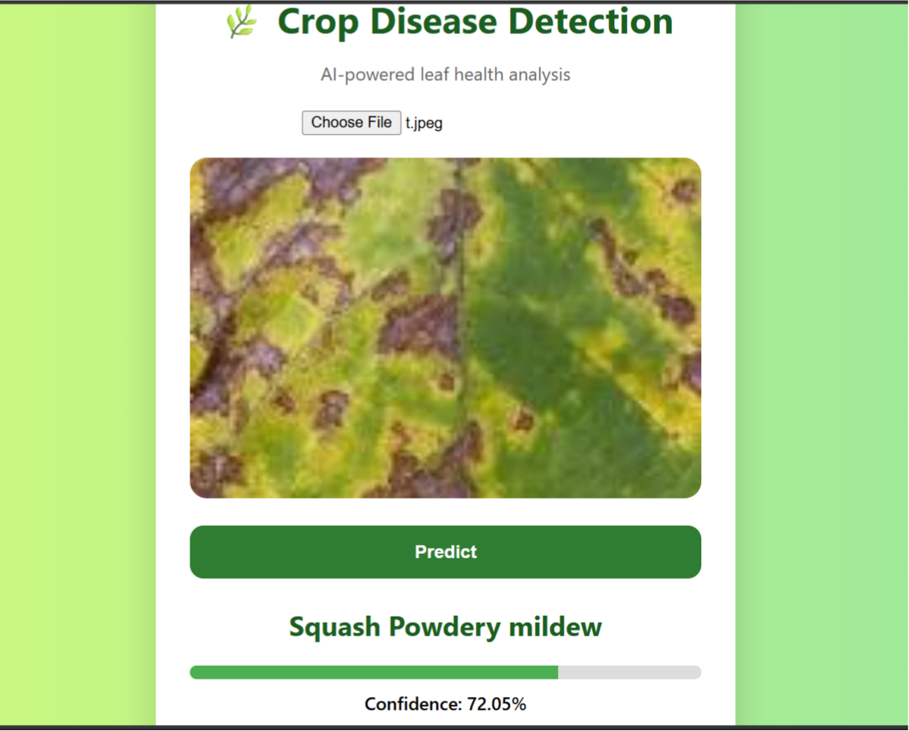

# 🌱 Crop Disease Detection System

An AI-powered Machine Learning project that detects crop diseases from plant leaf images and helps farmers identify diseases early for better crop management.

---

## 📌 Features

- 🌿 Detect crop diseases from leaf images
- 🤖 Deep Learning based prediction system
- 📷 Image classification using CNN
- 📊 Disease accuracy analysis
- ⚡ Fast and simple prediction

---

## 🛠️ Technologies Used

- Python
- TensorFlow / Keras
- React
- Javascript
- NumPy
- Pillow
- Flask
- Gunicorn

---

## 📂 Project Structure

```bash
Crop-Disease-Detection/
│── dataset/
│── models/
│── static/
│── templates/
│── app.py
│── train.py
│── requirements.txt
│── README.md
```

---

## ⚙️ Installation

Clone the repository:

```bash
git clone https://github.com/AbhinavMandal23/crop-disease-detection.git
```

Go to the project directory:

```bash
cd crop-disease-detection
```

Install dependencies:

```bash
pip install -r requirements.txt
```

Run the application:

```bash
python app.py
```

---

## 🧠 Model Information

The project uses a **Convolutional Neural Network (CNN)** model trained on crop leaf datasets to classify diseases accurately.

### Supported Diseases

- Tomato Leaf Blight
- Potato Early Blight
- Corn Rust
- Apple Scab
- Healthy Leaves Detection
- AND MANY MORE

---

## 📊 Workflow

1. Upload crop leaf image  
2. Preprocess image  
3. CNN model predicts disease  
4. Display prediction result  

---

## 🎯 Future Improvements

- 📱 Mobile application support
- 🌐 Cloud deployment
- 🗣️ Multi-language support
- 📈 Higher accuracy models
- 🔍 Real-time disease detection

---

## 📸 Project Preview

## 📸 Project Preview





---

## 🤝 Contributing

Contributions are welcome!

1. Fork the repository
2. Create a new branch
3. Commit changes
4. Push changes
5. Open a Pull Request

---

## 👨‍💻 Author

**Abhinav Mandal**

⭐ If you found this project useful, give it a star!
